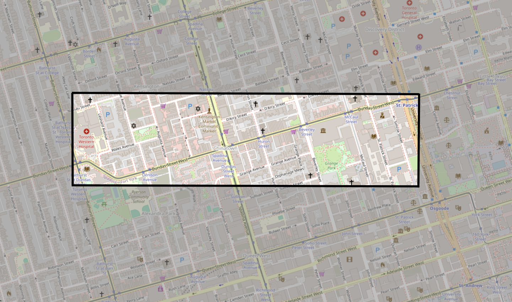
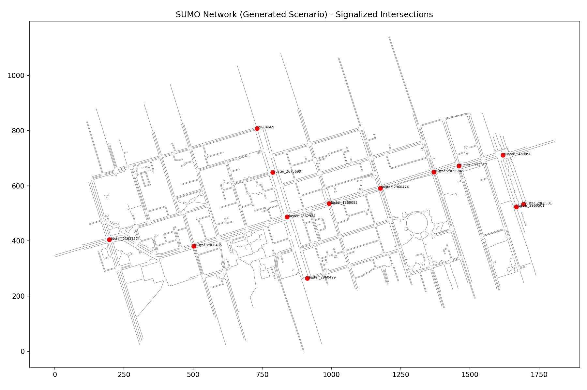
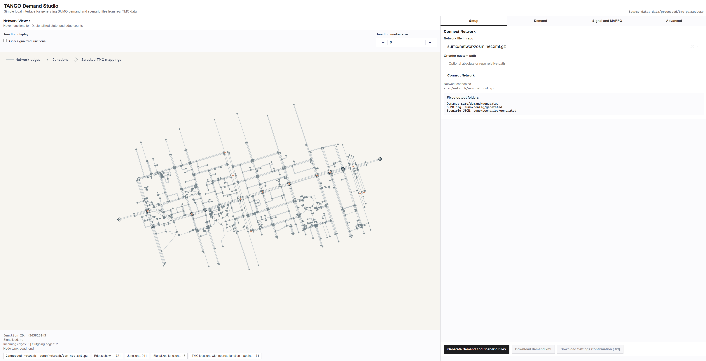
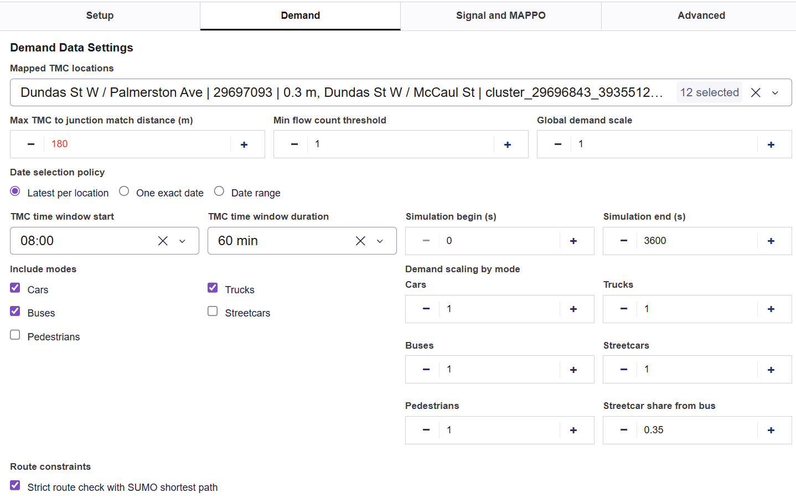
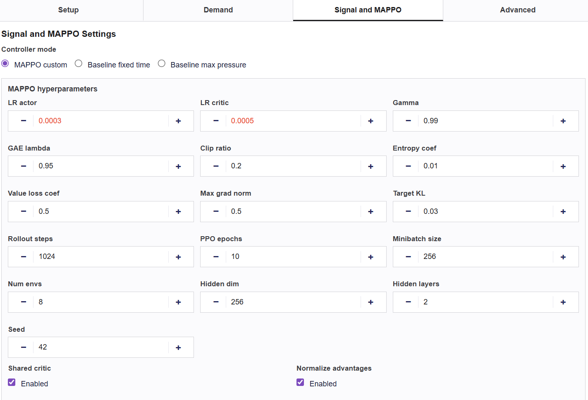
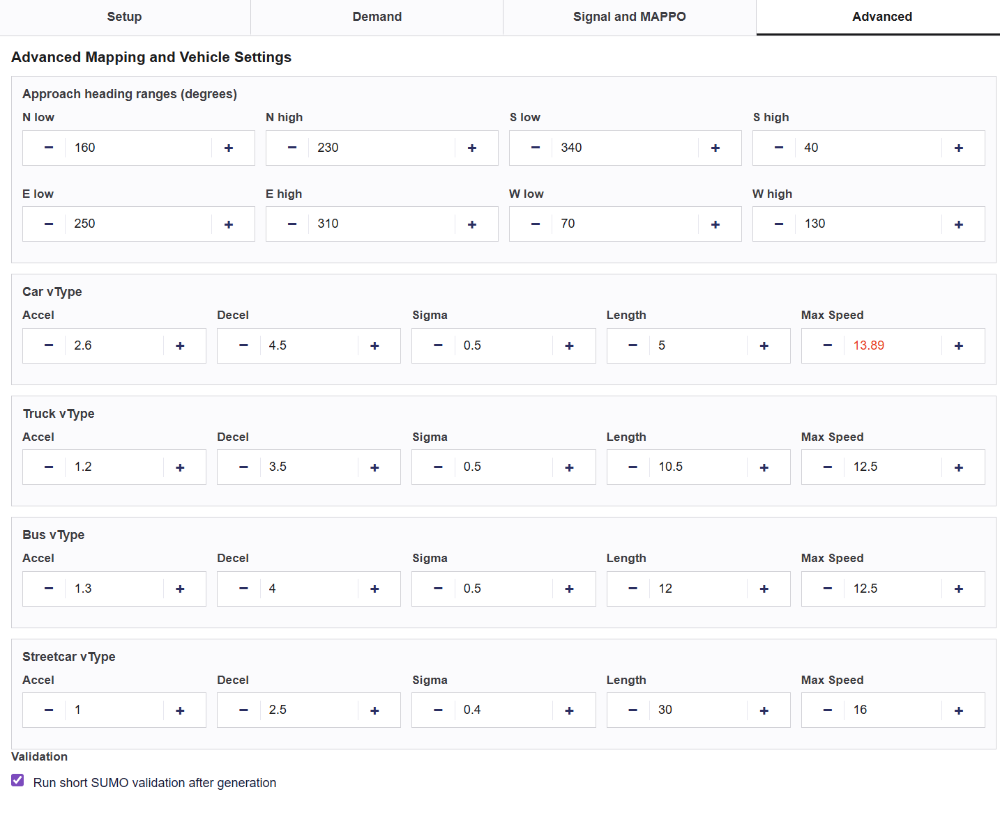

# ece324-TANGO

<a target="_blank" href="https://cookiecutter-data-science.drivendata.org/">
    
</a>

Traffic Adaptive Network Guidance & Optimization - real-time adaptive signal control and scenario planning module that evaluates how nearby projects (construction, lane closures, new public transit lines) alter demand/capacity to recommend signal timing/phasing updates 🕺 💃

## Corridor for Data Simulation
This project will focus on signalized intersections along Dundas Street West in Toronto, Ontario, Canada, starting from the intersection at University Avenue to the intersection at Bathurst St (see picture below). Data will be simulated for 12 intersections along this corridor. This corridor is chosen because TMC data is available for these intersections, and it runs along a streetcar route which will be useful for transit-focused scenarios for PIRA [see [proposal](reports/proposal/TANGO-proposal.pdf)].


The figure above shows the initial chosen area on SUMO web wizard. The initial scenario generation, for this selected area, is done only for cars and pedestrians. The figure below shows the generated scenario for the selected area (the selected area is inspected using ```sumolib``` and annotated using ```matplotlib``` to highlight signalized intersections, in ```notebooks\01_inspect_network.ipynb```). The red markers indicate the locations of signalized intersections along the corridor. 



## Environment Setup

This project uses [**pixi**](https://pixi.sh) as the single source of truth for the entire environment &mdash; data pipeline, ASCE training, evaluation, and Demand Studio all run from one lockfile (`pixi.lock`). The legacy `environment.yml` and `requirements.txt` files are kept as fallbacks but are no longer the recommended path.

### Recommended: pixi

Requires [pixi](https://pixi.sh/latest/installation/) (one-line installer; works on Linux, macOS, and Windows).

```bash
pixi install
```

That's it &mdash; pixi reads `pixi.toml`, solves against `pixi.lock`, and creates a fully reproducible environment under `.pixi/envs/default/` containing PyTorch with CUDA 12.8, SUMO Python bindings (`sumolib`, `traci`), the Demand Studio web app dependencies (`dash`, `plotly`, `geopandas`, `shapely`, `pyproj`, `lxml`, `openpyxl`), and the project package itself in editable mode. Run any project command with `pixi run <task>` (see `pixi.toml` for the full task list) or drop into the env with `pixi shell`.

> **CPU-only fallback.** Pixi will still install PyTorch on a CPU-only machine, but training is impractical without a GPU. CUDA 12.x is required for the curriculum-training pipeline.

### Legacy fallbacks (not recommended)

These remain so older instructions still work, but new development should target pixi.

<details>
<summary>Conda</summary>

```bash
conda env create -f environment.yml
conda activate tango
```

`environment.yml` predates the pixi consolidation and pins PyTorch with CUDA 12.1 instead of 12.8. If you do not have a compatible GPU, remove the `pytorch-cuda` line before creating the environment and install the CPU-only PyTorch build instead.
</details>

<details>
<summary>pip / venv</summary>

```bash
python -m venv .venv
# Windows
.venv\Scripts\activate
# macOS / Linux
source .venv/bin/activate

pip install -r requirements.txt
```

`requirements.txt` does not pin a specific PyTorch variant. Visit [pytorch.org](https://pytorch.org/get-started/locally/) to install the correct build for your platform before running the above command.
</details>

--------

## Data Workflow

### Environment and SUMO

See [Environment Setup](#environment-setup)

### Build or Obtain the Network
Use the OSM web wizard to create a SUMO network for the area of interest. This project contains the network files for the study area mentioned above.

### Inspecting the Network

```bash
jupyter notebook notebooks/01_inspect_network.ipynb
```

This notebook loads the network with `sumolib`, lists all traffic-light junctions and edges, and plots an annotated map. Useful for verifying the study area looks right and seeing which junctions are signalized.

### Map Intersections to SUMO Junctions

```bash
python scripts/03_map_intersections.py
```

This produces `data/processed/intersection_map.csv`. It takes the 11 known Dundas corridor intersections (hardcoded lat/lon) and matches each one to the nearest SUMO junction. The output includes junction coordinates, whether it has a traffic light, and the match distance.

### Parse TMC Data

```bash
python scripts/02_parse_tmc.py
```

Reads all CSV files in `data/raw/tmc/`, auto-detects the column layout, filters to rows that mention "Dundas" intersections, and writes `data/processed/tmc_parsed.csv`. This parsed file is used downstream by the demand generator.

The parsed TMC data can be explored with:
```bash
jupyter notebook notebooks/03_explore_tmc.ipynb
```

### Generate TLS Override Programs

```bash
python scripts/utils/tls_generator.py
```

Reads the SUMO network, generates fixed-cycle two-phase (EW/NS) signal programs for all non-cluster signalized junctions, and writes `sumo/network/tls_overrides.add.xml.gz`. This file is referenced by the simulation config.

The generated programs can be inspected with:
```bash
jupyter notebook notebooks/02_inspect_tls.ipynb
```

### Generate Sample Demand (Heuristic)

```bash
python scripts/04_generate_demand.py
```

Builds a sample `sumo/demand/demand.rou.xml` with heuristic flow rates derived from lane count and speed limit of each network boundary edge. This is useful for quickly smoke-testing the network before TMC data is involved. **This file is overwritten by the calibration step below.**

### Calibrate Demand from TMC Data

```bash
python scripts/05_calibrate.py
```

Reads TMC turning-movement counts for the 8 study intersections, maps each TMC approach direction (N/S/E/W) to SUMO incoming edges via heading angles, resolves right/through/left outgoing edges, and writes one flow per valid approach-movement combination. After writing `sumo/demand/demand.rou.xml`, prints a GEH validation summary comparing assigned approach totals against the original TMC volumes and saves the results to `data/processed/calibration_report.csv`.

### Demand Studio Web Interface

Use the local web app below to generate custom SUMO demand and scenario configuration files from real TMC data without using SUMO OSM Web Wizard demand generation.

```bash
python apps/demand_studio/app.py
```

Then open `http://127.0.0.1:8050` in your browser.

UI walkthrough screenshots:

Main UI (network viewer + setup/generation workflow):



Demand settings tab (TMC location mapping, date/time policy, mode scaling):



Signal and MAPPO settings tab (controller mode, fixed-time and MAPPO hyperparameters):



Advanced vehicle settings tab (approach heading ranges, per-mode vehicle parameters, validation):



UI/processing stack used in Demand Studio:
- Dash for the local web UI, tabbed layout, state stores, and callbacks
- Plotly (graph_objects, Scattergl) for interactive network rendering and hover inspection
- Pandas and NumPy for TMC filtering, aggregation, and numeric transformations
- SUMO sumolib for network loading, topology inspection, and route/connectivity checks
- lxml for writing SUMO route, additional, and config XML files
- Custom CSS in `apps/demand_studio/assets/demand_studio.css` for styling

What the interface does:
- Connects to a selected `*.net.xml` or `*.net.xml.gz` SUMO network file
- Renders the network in-app with hover details for each junction
    - junction ID
    - signalized status
    - incoming and outgoing edge counts
- Maps TMC locations to nearest network junctions
- Generates demand directly from `data/processed/tmc_parsed.csv`
- Supports cars, trucks, buses, streetcars, and pedestrians
- Lets you choose signal control mode
    - MAPPO custom
    - baseline fixed time
    - baseline max pressure
- Exposes MAPPO hyperparameters and signal settings in the same UI

Important data rule:
- Generated demand in this interface is based only on `data/processed/tmc_parsed.csv`

Fixed output locations (not user-selectable):
- Demand route files: `sumo/demand/generated/*.rou.xml`
- SUMO config files: `sumo/config/generated/*.sumocfg`
- Scenario settings export: `sumo/scenarios/generated/*.json`
- Fixed-time TLS files: `sumo/network/generated/*_fixed_tls.add.xml.gz`

Network file note:
- `net.xml` (or `net.xml.gz`) stores network structure and traffic control topology
- Demand behavior is applied later through route and scenario files

### Run Smoke Test

```bash
python scripts/00_smoke_test.py
```

Runs a quick 60-second headless simulation with random trips to confirm SUMO and TraCI are working. Prints vehicle and traffic light counts every 10 steps.

### Run Baseline Simulation

Headless (command line):
```bash
sumo -c sumo/config/baseline.sumocfg
```

With GUI:
```bash
sumo-gui -c sumo/config/baseline.sumocfg
```
--------

## Interim Project: Demand Generation and Calibration

This section documents what the current scripts and notebooks do for the interim phase of the project. The scope right now is limited to **passenger vehicle traffic only**. Pedestrian demand is not generated or simulated at this stage, though the network itself does contain pedestrian infrastructure (crossings, walking areas). The TLS overrides handle pedestrian signal indices passively but do not provide dedicated pedestrian phases.

### What Each Script Does

| Script | Purpose | Key Inputs | Key Outputs |
|--------|---------|------------|-------------|
| `00_smoke_test.py` | Checks that SUMO and TraCI are installed and working. Generates random trips, runs a 60-second headless simulation, and prints vehicle/TLS counts at each step. | `osm.net.xml.gz`, `tls_overrides.add.xml.gz` | Console output, `random_trips.rou.xml` (test only) |
| `02_parse_tmc.py` | Reads all raw TMC CSV files from `data/raw/tmc/`, auto-detects column names across different file formats, and filters rows to intersections containing "Dundas" in the location name. | Raw TMC CSVs | `data/processed/tmc_parsed.csv` |
| `03_map_intersections.py` | Takes 11 known intersection locations along Dundas (hardcoded WGS84 lat/lon pairs) and finds the nearest SUMO junction within 100 m for each one. Records whether that junction has a traffic light. | `osm.net.xml.gz` | `data/processed/intersection_map.csv` |
| `04_generate_demand.py` | Generates sample heuristic demand for smoke-testing the network. Identifies boundary entry/exit edges that allow passenger vehicles, verifies route reachability, and writes one flow per entry-exit pair with lane/speed-based volume estimates. **Not TMC-calibrated.** | `osm.net.xml.gz` | `sumo/demand/demand.rou.xml` (heuristic) |
| `05_calibrate.py` | Generates TMC-calibrated demand. Reads the most recent AM-peak (08:00–09:00) turning-movement counts per study intersection, maps TMC approach directions to SUMO edges by heading angle, resolves right/through/left outgoing edges, writes one flow per valid approach-movement, and validates with GEH. | `osm.net.xml.gz`, `tmc_parsed.csv`, `intersection_map.csv` | `sumo/demand/demand.rou.xml` (calibrated), `calibration_report.csv` |
| `utils/tls_generator.py` | Generates fixed-cycle two-phase signal programs for every non-cluster signalized junction. Classifies each signal index as EW or NS based on edge heading angle, then builds a 6-phase plan. | `osm.net.xml.gz` | `sumo/network/tls_overrides.add.xml.gz` |

### Demand Generation Settings

Two scripts can produce `demand.rou.xml`. Use **`04_generate_demand.py`** for quick smoke tests and **`05_calibrate.py`** for the final TMC-calibrated demand.

#### Sample Demand (`04_generate_demand.py`)

Heuristic flow rates based on lane count and speed limit of each boundary entry edge. Not derived from TMC data.

| Parameter | Value | Notes |
|-----------|-------|-------|
| Vehicle type | `car` | Only passenger vehicles in this phase |
| Simulation period | 0 to 3600 s | One hour (AM peak) |
| Flow rate (multi-lane, fast) | 300 veh/hr | Edges with 2+ lanes and speed > 11 m/s |
| Flow rate (multi-lane, slow) | 150 veh/hr | Edges with 2+ lanes and speed ≤ 11 m/s |
| Flow rate (single-lane) | 50 veh/hr | All single-lane entry edges |
| Flow split | 3 exit edges | Each entry distributes across 3 exits |

#### TMC-Calibrated Demand (`05_calibrate.py`)

Flow rates derived directly from City of Toronto TMC turning-movement counts for the 8 study intersections.

| Parameter | Value | Notes |
|-----------|-------|-------|
| Vehicle type | `car` | Only passenger vehicles in this phase |
| Simulation period | 0 to 3600 s | One hour (AM peak, 08:00–09:00) |
| TMC time bins | 4 × 15-minute bins | Summed to hourly approach totals |
| Count date selection | Most recent | Per intersection, latest available count date |
| Approach mapping | Edge heading angle | N/S/E/W classified from SUMO edge geometry |
| Turn classification | Relative heading | Right (−90°), through (0°), left (+90°) |
| Route verification | `net.getShortestPath()` | Unreachable OD pairs are skipped |
| Validation metric | GEH statistic | GEH < 5 per approach = pass |

**Common settings (both scripts):**

| Parameter | Value |
|-----------|-------|
| Acceleration | 2.6 m/s² |
| Deceleration | 4.5 m/s² |
| Driver imperfection (sigma) | 0.5 |
| Vehicle length | 5.0 m |
| Max speed | 13.89 m/s (~50 km/h) |
| Depart lane | `best` |
| Depart speed | `max` |

**Edge filtering rules (both scripts):**
- Only edges that allow the `passenger` vehicle class are used
- Entry edges must have at least one outgoing connection to another passenger-allowed edge
- Each origin-destination pair is verified reachable via `net.getShortestPath()` before a flow is created
- Unreachable pairs are skipped (count printed to console)

### TLS Generator Settings

The TLS generator (`scripts/utils/tls_generator.py`) creates a fixed-cycle signal plan and writes it as a SUMO additional file. It replaces the default programs from OSM with a controlled baseline.

| Parameter | Value |
|-----------|-------|
| Total cycle length | 60 s |
| EW green | 30 s |
| NS green | 20 s |
| Yellow (each direction) | 3 s |
| All-red (each direction) | 2 s |
| Program ID | `baseline_fixed` |
| Signal type | `static` |
| Green indicator for vehicles | `g` (yield green, avoids conflict warnings) |
| Pedestrian/crossing indices | `G` during all-red phases only |

**How the generator classifies signal indices:**

Each signalized junction has a set of signal indices (one per connection). The generator looks at the incoming edge for each index and classifies it:

1. If the edge function is `crossing` or `walkingarea`, the index is **excluded** from vehicle phases. It gets a `G` only during the all-red intergreen phases to satisfy SUMO's requirement that every index receives at least one green.
2. For vehicle edges, the incoming edge's geometric heading is computed from its shape coordinates.
3. Headings in the ranges 0-45, 135-225, or 315-360 degrees are classified as **EW**. Everything else is **NS**.
4. If a junction ends up with all indices in one group (no split), the indices are forced into a 50/50 EW/NS split by position.

**What gets skipped:**
- Junctions with IDs starting with `cluster_` are skipped entirely. These are merged multi-intersection clusters in the SUMO network where internal junction conflicts make a simple two-phase plan unreliable. They fall back to whatever program the network already has.
- Junctions where no signal index count can be determined are also skipped.

### Simulation Configuration

The baseline simulation is configured in `sumo/config/baseline.sumocfg`:

| Setting | Value | Purpose |
|---------|-------|---------|  
| Network | `osm.net.xml.gz` | OSM-derived compressed network |
| Routes | `demand.rou.xml` | Vehicle flows from demand generator |
| Additional files | `tls_overrides.add.xml.gz` | Custom TLS programs |
| Simulation start | 0 s | |
| Simulation end | 3600 s | One hour |
| Step length | 1.0 s | |
| Time to teleport | 300 s | Stuck vehicles get teleported after 5 min |
| Ignore route errors | `true` | Skip vehicles with no valid route instead of crashing |
| Step log | disabled | Reduces console noise |

--------

## Roadmap

- [x] Passenger vehicle demand generation
- [x] Fixed-cycle two-phase traffic signal control
- [x] TMC data integration
- [x] TMC-calibrated demand with GEH validation
- [ ] Streetcar simulation and priority signaling
- [ ] Pedestrian demand generation and crossing behavior
- [ ] Bicycle traffic modeling
- [ ] PIRA: Scenario planning and prediction using GNN

--------

## Data pipeline files

Files relevant to the data pipeline (TMC parsing, network preparation, Demand
Studio, and curriculum scenario generation):

```
ece324-TANGO/
├── DATA.md                    ← this document
├── pixi.toml                  ← single env for the whole project
├── environment.yml            ← legacy conda fallback (kept; pixi is canonical)
├── requirements.txt           ← legacy pip fallback
│
├── apps/demand_studio/
│   ├── app.py                       ← Dash app: TMC → SUMO scenario generator
│   └── assets/demand_studio.css     ← UI styling
│
├── scripts/
│   ├── 00_smoke_test.py             ← SUMO + TraCI smoke run (60 s, random trips)
│   ├── 02_parse_tmc.py              ← Parse raw TMC CSVs → tmc_parsed.csv
│   ├── 03_map_intersections.py      ← Match named intersections to SUMO junctions
│   ├── 04_generate_demand.py        ← Heuristic demand for smoke tests
│   ├── 05_calibrate.py              ← TMC-calibrated demand with GEH validation
│   ├── generate_curriculum.py       ← Build the four curriculum scenarios via Demand Studio
│   └── utils/tls_generator.py       ← Fixed-cycle TLS override generator
│
├── notebooks/
│   ├── 01_inspect_network.ipynb     ← Network geometry and signalized nodes
│   ├── 02_inspect_tls.ipynb         ← Inspect generated TLS programs / phase states
│   └── 03_explore_tmc.ipynb         ← Explore parsed TMC volumes
│
├── data/
│   ├── raw/tmc/                     ← City of Toronto raw TMC CSVs (1980s–2020s)
│   │   ├── tmc_most_recent_summary_data.csv
│   │   ├── tmc_raw_data_1980_1989.csv
│   │   ├── tmc_raw_data_1990_1999.csv
│   │   ├── tmc_raw_data_2000_2009 (1).csv
│   │   ├── tmc_raw_data_2010_2019 (2).csv
│   │   ├── tmc_raw_data_2020_2029 (2).csv
│   │   └── tmc_summary_data.csv
│   └── processed/
│       ├── tmc_parsed.csv           ← Filtered, standardised TMC dataset
│       ├── intersection_map.csv     ← Intersection name → SUMO junction
│       └── calibration_report.csv   ← GEH validation report
│
├── sumo/
│   ├── network/
│   │   ├── osm.net.xml.gz           ← SUMO network derived from OSM corridor
│   │   ├── osm.poly.xml.gz          ← Building polygons (visualisation)
│   │   ├── osm_bbox.osm.xml.gz      ← Raw OSM bounding-box extract
│   │   ├── tls_overrides.add.xml.gz ← Generated/fallback TLS programs
│   │   └── build.bat                ← Windows helper for network rebuilds
│   ├── config/baseline.sumocfg      ← Baseline SUMO config used by smoke runs
│   ├── demand/
│   │   ├── demand.rou.xml           ← Latest generated baseline demand (overwritten by 05_calibrate.py)
│   │   ├── random_trips.rou.xml     ← Smoke-test random trips
│   │   └── curriculum/              ← Four TMC-calibrated scenarios used for ASCE training
│   │       ├── am_peak.rou.xml + .settings.txt
│   │       ├── pm_peak.rou.xml + .settings.txt
│   │       ├── demand_surge.rou.xml + .settings.txt
│   │       └── midday_multimodal.rou.xml + .settings.txt
│   └── scenarios/generated/         ← Demand Studio scenario metadata exports
│
├── docs/assets/images/              ← Demand Studio screenshots, network map, OSM wizard
│   ├── demand_studio_1.png ... demand_studio_4.png
│   └── sumo_web_wizard.png
│
└── tests/test_data.py               ← Data-pipeline regression and integrity tests
```

--------

