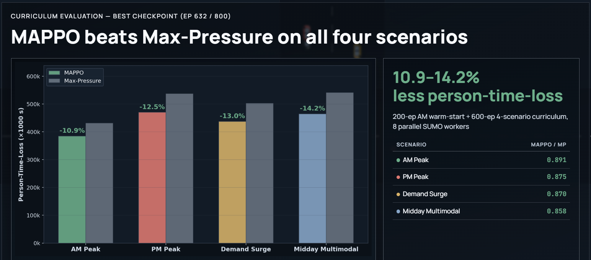
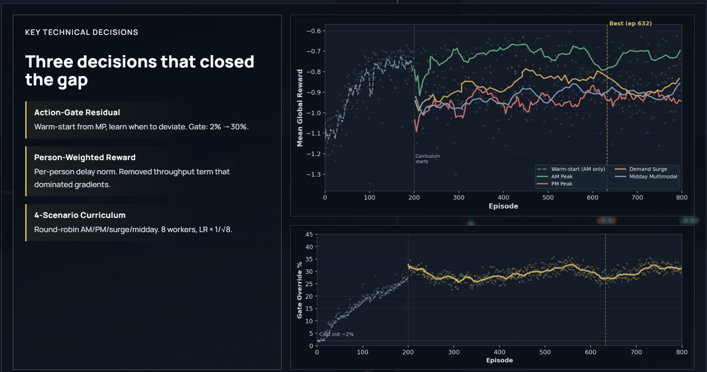
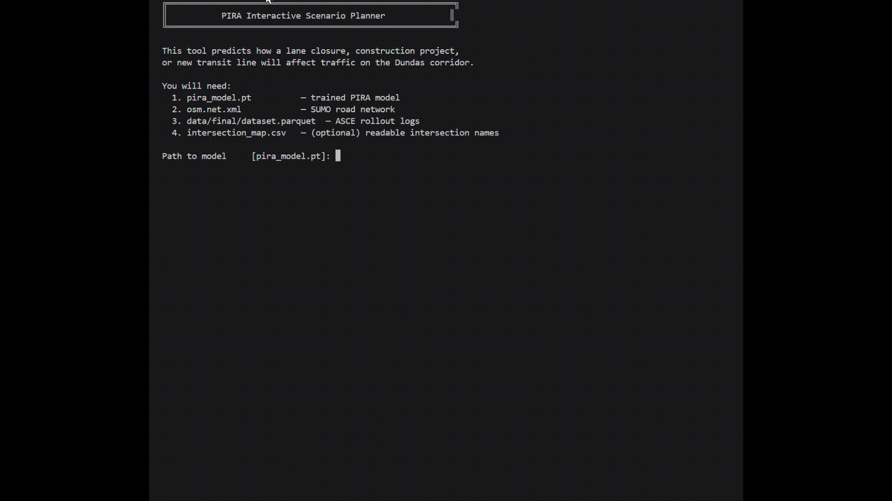

# ece324-TANGO
Traffic Adaptive Network Guidance &amp; Optimization - real-time adaptive signal control and cenario planning module that evaluates how nearby projects (construction, lane closures, new public transit lines) alter demand/capacity to recommend signal timing/phasing updates 🕺 💃
-
Simulating data for MAPPO training/ Data Pipeline: ./DATA.md \
Training and running ASCE: ./ASCE.md \
Training and running PIRA (Beta): ./PIRA.md 
-
Project Presentation: https://yashnkapadia.github.io/ece324-TANGO/TANGO-presentation.html (Highlights below) \

-
Team: Aryan Shrivastava Kotaro Murakami Yash Kapadia
-