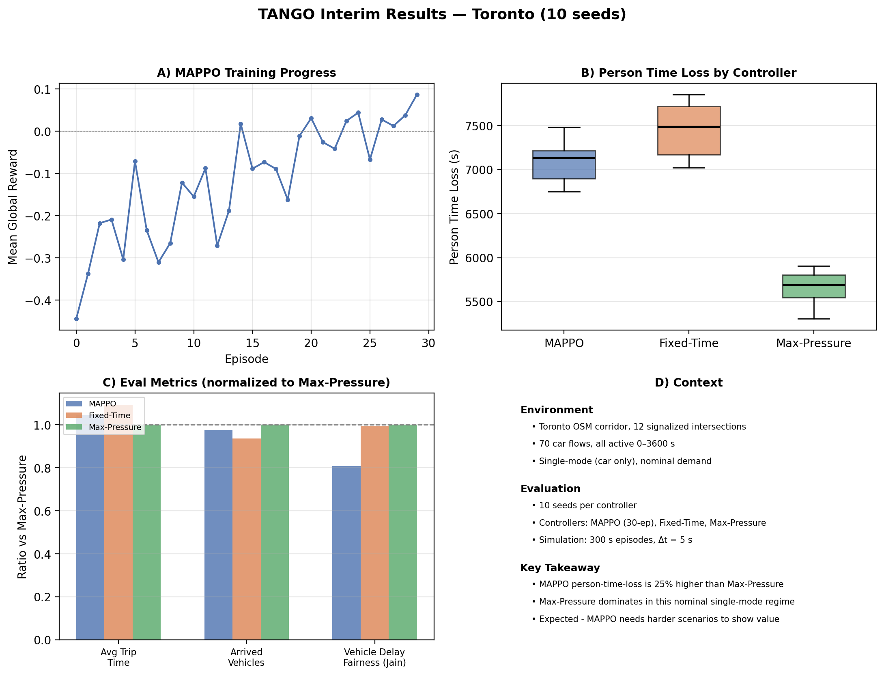

# TANGO — Traffic Adaptive Network Guidance & Optimization

<a target="_blank" href="https://cookiecutter-data-science.drivendata.org/">
    
</a>

Real-time adaptive signal control (ASCE) and scenario planning (PIRA) for a Toronto corridor, trained with Multi-Agent PPO in SUMO.

> **Branch:** `code-setup` — ASCE training/eval pipeline and Toronto corridor benchmark.
> For demand generation and TMC calibration details, see the [`data-setup`](../../tree/data-setup) branch.

## Overview

This branch implements the **Adaptive Signal Control Engine (ASCE)** pipeline:

1. **Train** a shared-parameter MAPPO policy across all signalized intersections.
2. **Evaluate** MAPPO against Fixed-Time and Max-Pressure baselines.
3. **Generate** reproducible report figures from evaluation artifacts.

The current benchmark uses a Toronto OSM corridor with TMC-calibrated demand under nominal (car-only) conditions. The evaluation story centers on the **objective retest** run (10 seeds per controller).

## Current Toronto Setup

| Property | Value |
|---|---|
| Network | Toronto OSM corridor, 12 signalized intersections |
| Demand | 70 car flows, all active 0–3600 s (`sumo/demand/demand.rou.xml`) |
| Modes | Car only (no transit/pedestrian in current benchmark) |
| Simulation | 300 s episodes, delta-time = 5 s |
| Training | 30 episodes, objective reward mode, observation normalization |
| Evaluation | 10 random seeds per controller (MAPPO, Fixed-Time, Max-Pressure) |

## Quick Start

```bash
pixi install

# Train MAPPO on Toronto demand
pixi run train-asce-toronto-demand

# Evaluate all controllers
pixi run eval-asce-toronto-demand

# Generate interim report figures
pixi run plot-interim-figures
```

## Current Findings

The figure below summarizes results from the objective retest evaluation (10 seeds per controller):



**Key results:**

- **Max-Pressure dominates** on delay and throughput in this nominal single-mode regime. It achieves the lowest person-time-loss (~5,660 s) and highest arrived-vehicle count.
- **MAPPO underperforms Max-Pressure** on person-time-loss by approximately 25%. Vehicle-delay fairness (Jain index ~0.48) is also lower than Max-Pressure (~0.59), though no controller reaches the proposal's 0.8 target.
- **Fixed-Time is the weakest controller** on delay (~7,450 s person-time-loss), but matches Max-Pressure on vehicle-delay fairness (~0.58).
- **MAPPO's training curve** (Panel A) shows learning progress over 30 episodes, with mean global reward trending upward — the policy is improving but has not converged.

These results are **expected in the current environment**. Max-Pressure is provably throughput-optimal for single-commodity demand and performs very well when all flows are homogeneous cars on a simple corridor. MAPPO is expected to show its value in harder scenarios: multi-modal demand, incident response, and demand spikes that break the assumptions Max-Pressure relies on.

> A separate time-loss normalization run (`time_loss_e10`) has been collected but is deferred to further analysis.

## Why Max-Pressure Is Strong Here

Max-Pressure grants green to the phase with the highest queue differential, which is provably throughput-optimal under stationary, single-commodity demand. The current Toronto benchmark — 70 uniform car flows on a single corridor — is exactly the regime where Max-Pressure excels. MAPPO must learn coordination patterns that are trivially solved by Max-Pressure's local queue-balancing heuristic. The gap is expected to narrow and reverse when:

- Transit and pedestrian flows introduce multi-modal conflicts.
- Demand spikes or incidents create non-stationary conditions.
- Corridor-level coordination becomes necessary (e.g., green waves).

## Next Steps

1. Introduce multi-modal demand (transit, pedestrians) on the `data-setup` branch.
2. Extend MAPPO training episodes and tune hyperparameters.
3. Test MAPPO under demand perturbation scenarios where Max-Pressure's local heuristic breaks.
4. Begin PIRA (scenario planning) surrogate development.

## Project Organization

```
├── ece324_tango/           <- Source code (ASCE env, MAPPO, baselines, plotting)
│   ├── asce/               <- ASCE env adapters, baselines, MAPPO, schema
│   ├── modeling/           <- Train and predict entry points
│   └── plots.py            <- Interim report figure generation
├── sumo/                   <- SUMO network and demand files
│   ├── network/            <- Toronto OSM network
│   └── demand/             <- TMC-calibrated and random-trip demand
├── reports/
│   ├── results/            <- Evaluation CSVs
│   └── figures/            <- Generated plots (reproducible via pixi)
├── tests/                  <- Unit tests
├── pixi.toml               <- Environment, dependencies, and task definitions
└── docs/                   <- Notes, runbook, plans
```
